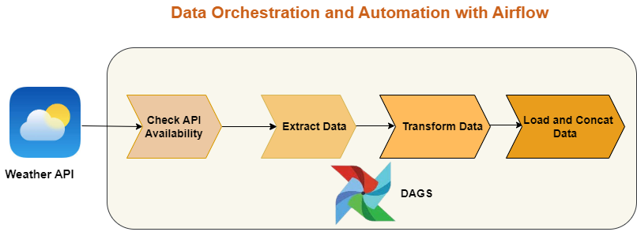

# ETL For Calgary Weather Data with Airflow

This project utilizes Apache Airflow to orchestrate and automate the availability of Calgary weather data from an API. The data is extracted, transformed, and stored as CSV files. Finally, all the CSV files are concatenated into a single file for further anlaysis and storage in the cloud (AWS S3, Aurora, Azure SQL, etc) or on-premise (MYSQL, MSSQL or Postgres Database)

## Project Overview

The main goal of this project is to automate the process of fetching weather data from an API (Open weather API) and preparing it for further analysis. The project follows the Extract, Transform, Load (ETL) process to ensure the data is in a usable format.

## Workflow

1. **Data Extraction**: Airflow triggers a task to fetch weather data from the API at regular intervals (daily in this case). The extracted data includes various weather parameters such as temperature, humidity, and precipitation.

2. **Data Transformation**: The extracted data is then transformed to ensure consistency and compatibility. This may involve cleaning the data, converting units, or aggregating data points.

3. **Data Storage**: The transformed data is stored as CSV files in a designated directory. Each CSV file represents a specific time period or location.

4. **Concatenation**: Finally, Airflow triggers a task to concatenate all the CSV files into a single file. This consolidated file can be used for further analysis or visualization.

## Benefits

- Automation: The use of Airflow allows for the automation of the entire ETL process, reducing manual effort and ensuring data availability on a regular basis.

- Scalability: Airflow's task-based architecture enables easy scaling of the project to handle larger datasets or additional data sources.

- Flexibility: The project can be easily customized to fetch data from different weather APIs or incorporate additional data transformation steps as per specific requirements.

## Getting Started

To get started with this project, follow the steps below:

1. Install Apache Airflow and set up the necessary dependencies.

2. Configure the Airflow DAG (Directed Acyclic Graph) to define the workflow and tasks.

3. Implement the data extraction, transformation, and storage tasks using appropriate Python libraries and APIs.

4. Test the workflow by running Airflow locally or deploying it to a production environment.

For detailed instructions and code examples, refer to the project documentation.

## Conclusion

By leveraging Apache Airflow, this project provides a robust and automated solution for fetching, transforming, and storing weather data. The resulting CSV files can be easily analyzed or integrated into other data pipelines for further processing.