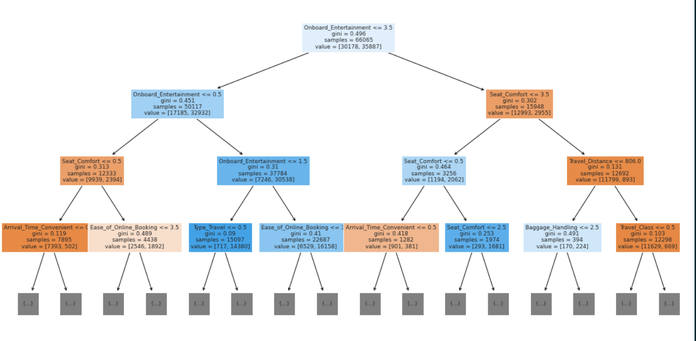
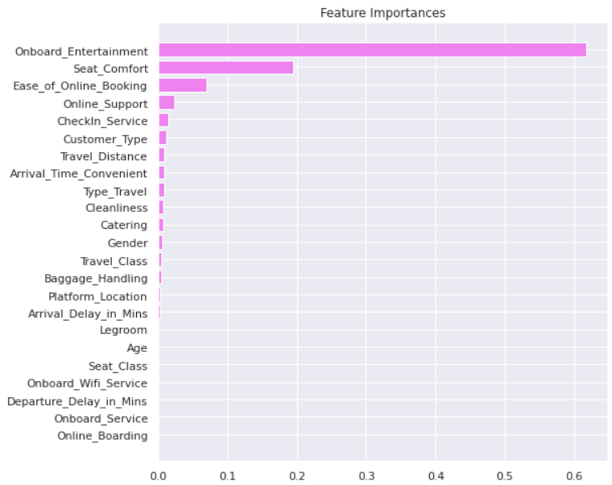
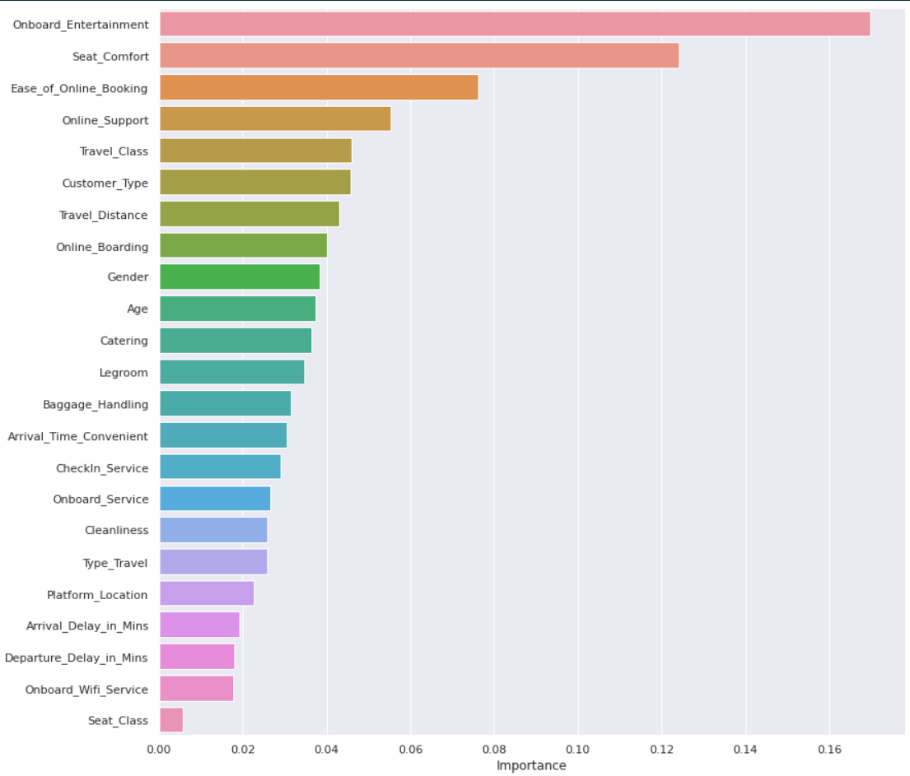

# Projects Portfolio
This Portfolio contains multiple machine learning projects that I have worked on to explore data and create models for predictions
**Each project includes:**
  * A detailed explanation of the project requirements
  * Detailed Exploratory Data Analysis for exposing hidden insights
  * Multiple Machine learning models, selecting the best performing model for deployment.

The Project Portfolio includes Classification, Advanced Regression Techniques, Deep Learning, and Recommendation Systems algorithms.

## :thumbsup: Projects

## 1. Energy Prices Prediction in the United Kingdom:

Due to inflation, the energy price has increased in the United Kingdom. The government wants to determine the families and individuals who cannot meet this price increase. There are many factors (features) here to determine or predict the inability to meet up with energy prices. These features are categorized into four (4):
  - Temperature: The weather of a day could have a significant effect on the energy consumption by consumers. In winter, the temperature is cold, and to keep warm, energy is consumed through the heating system. During summer, the temperature rises and as such, the use of the heating system is at its minimum or not in use at all. But due to high temperatures, there is a need to drop the temperature by air-conditioning. Both situations may lead to an increase in energy consumption.
 - Appliances: Another category that influences energy consumption is appliances. The features to consider here may include the type of appliances such as Televisions, washing machines, dryers, microwaves, and electric kettles. Another feature here is the number of each appliance and the frequency of their uses. Other features may include age and the appliances’ energy rating, which can significantly affect electricity consumption. The lower the age of an appliance, the less consumption of energy. Due to technological advancements, newer appliances tend to consume less energy. The lower number of electrical appliances and decreases in usage may reduce energy consumption and vice versa, influencing the increase or decrease of electricity cost.
- Consumer habit: This feature can either increase or decrease users' electricity consumption. Little changes made to these features which may include ensuring electrical appliances are switched off when not used, turning off light bulbs and heaters, reducing the temperature of the water heater, and switching off all devices before sleeping or when not in the home can help reduce consumer’s electricity consumption and as a result decrease in electricity cost. The vice versa can lead to an increase in electricity cost.
- Demography: There are quite a few features to consider here. The characteristics of the consumer which may include age, gender, income, education, home ownership, sexual orientation, marital status, family size, health, and disability status can influence energy consumption and the ability to pay increasing electricity costs. If the family size is large, there is a tendency for an increase in electricity consumption and an overall increase in electricity cost. With a high level of education and good income, the obligation to pay the increasing electricity cost may not be difficult for the consume
About 26 features are categorized into the 4 groups above, which are explored and analyzed.

The project is divided into two:

**Classification Problem**: With these features, we are to determine if a consumer is having difficulties with increasing energy prices or not. The target variable and prediction is the True (1) value if the customer is having difficulties with the increasing energy prices and False (0) if vice versa.

The following processes were considered:

- **Data ingestion/Loading of Data**
- **Data Cleaning and preprocessing**
- **Feature Engineering**
- **Model Development and Prediction**
  
  - The data was split into train and test set
  - The whole data was used for cross-validation with CV = 5. This means that the model will split the data into 5, using 4 folds of the data as training data to train the model and 1 fold as test data to test the model. This will be done five times with different folds as test data. At any point, the test data are different. They help to validate the model and see if the model is generalized and not overfitting or underfitting when unknown (unseen data) is used to test the model.
  - Nine (9) models were developed which include LGBM, XGB, GradientBoost, Random Forest, Quadratic Discriminant, Linear Discriminant, Logistic Regression, and GaussianNB. 
  - The model performance was determined with the following metrics:
    - Accuracy
    - Precision
    - Recall
    - Confusion Matrix
    - Classification Report

  The table below displays the performance of each trained model on test data.
  
  
  
  Here is a visual representation of the model performance
  
  

  With the accuracy of 89%, 89% on cross-validation score on test data, and 90.1% accuracy on unknown data, the model with the best performance is the **XGB Classifier**

**Regression Problem**:

The energy company desires to predict the variation in the annual expenditure that a customer is going to have due to the increase in the energy cost. If the customer is going to spend more in the coming year, the price is positive, but if the customer is spending less, then the value will be
negative. With the provision of historical data, a prediction of the expenditure is carried out using machine learning techniques. This predicted value on the historical data is compared with the actual value and the technique/model with the lowest mean squared error (the metric utilized to determine the performance of the model) is utilized for the prediction of the expenditure over unknown or future data. The machine learning Regressors are utilized to create the model. We use Regression techniques because the predicted target values are numeric.

The following processes were considered:

- **Data ingestion/Loading of Data**
- **Data Cleaning and preprocessing**
- **Feature Engineering**
- **Model Development and Prediction**
  - Six Regression models were developed which include: Linear regression, LassoLarsCV, Ridge, Decision Tree, Random Forest, and Gradient gradient-boosting regressors
  The computed metrics for model performance are the R2 score and Mean Squared Error (MSE). 

  The table for the models' performance is shown below.
  
  

  Gradient Boost outperformed other regressors with an R2 score of 0.80 with a visual representation shown below:
  

## 2. Travelers' Experience Prediction (Hackathon)
This problem statement is based on the Shinkansen Bullet Train in Japan, and passengers’ experience with that mode of travel. This machine-learning exercise aims to determine the relative importance of each parameter concerning their contribution to the passengers’ overall travel experience. The dataset contains a random sample of individuals who traveled on this train. The on-time performance of the trains along with passenger information is published in a file named **Traveldata_train.csv**.  These passengers were later asked to provide their feedback on various parameters related to the travel along with their overall experience. These collected details are made available in the survey report labeled **Surveydata_train.csv**.

In the survey, each passenger was explicitly asked whether they were satisfied with their overall travel experience or not, and that is captured in the data of the survey report under the variable labeled **Overall_Experience**. 

The objective of this problem is to understand which parameters play an important role in swaying passenger feedback towards a positive scale. You are provided test data containing the travel data and the survey data of passengers. Both the test data and the train data are collected at the same time and belong to the same population.

### The Goal
- We are to determine the features that play important roles in swaying the passenger feedback toward positive.
- To predict whether a passenger was satisfied or not considering his/her overall experience of traveling on the Shinkansen Bullet Train (A Classification Problem)

**Dataset:**

The problem consists of 2 separate datasets: Travel data & Survey data. Travel data has information related to passengers and attributes related to the Shinkansen train, in which they traveled. The survey data is aggregated data of surveys indicating the post-service experience. You are expected to treat both these datasets as raw data and perform any necessary data cleaning/validation steps as required.

The data has been split into two groups and provided in the Dataset folder. The folder contains both train and test data separately.

Train_Data
Test_Data

Target Variable: Overall_Experience (1 represents ‘satisfied’, and 0 represents ‘not satisfied’)

The training set is used to build a machine learning model. The training set has labels for the target column - Overall_Experience.

The testing set is used to see how well your model performs on unseen data. For the test set, it is expected to predict the ‘Overall_Experience’ level for each participant.

**Evaluation Criteria:**

Accuracy Score: The evaluation metric is simply the percentage of predictions made by the model that turned out to be correct. This is also called the accuracy of the model. It will be calculated as the total number of correct predictions (True Positives + True Negatives) divided by the total number of observations in the dataset.
 
In other words, the best possible accuracy is 100% (or 1), and the worst possible accuracy is 0%.

**Note**: In classification, the class of interest is considered the positive class.

## :thumbsup: -> Solution

The following processes were carried out

- Loading of Data
- Data Description
- Exploratory Data Analysis
  - Univariate Analysis
- Deep Learning Models
  - Split data into train and test set
  - Developed 3 Deep learning models
    - Model 1 has an accuracy of 55% with F1-Score of 71%
    - Model 2: Added more hidden layers. Model accuracy is 88% with an F1-Score of 89%. - The model improved significantly compared with model 1 with an accuracy of 88% as against 55% of model 1. The f1 score improved significantly as well from 71% to 89%. The model is not overfitting and is well generalized. As the number of layers in the neural network has increased, we can see that the macro F1 score has increased, and the False positive percentage has decreased. 
    - Model 3 Batch Normalization Techniques: There is a lot of noise in the model, and it seems to have overfitted the training data because there is a significant difference in performance between train and validation. 
    
    - Random Search CV:

    Some important hyperparameters to look out for while optimizing neural networks are:

    * Type of Architecture

    * Number of Layers

    * Number of Neurons in a layer

    * Regularization hyperparameters

    * Learning Rate

    * Type of Optimizer

    * Dropout Rate

    - Using the keras-tuner, the model performance is 88% accuracy and 89% F1-score.
- Other machine Learning Models:
  - **Logistic Regression**: Accuracy is 68% while F1-score is 72% on train data. On test data, the accuracy is 69% with 72% F1-score. No significant difference.
  - **Support Vector Machine (SVM)** :
    - SVM with Linear Kernel: Accuracy of 76% and F1-Score of 79% on train data. On test data, accuracy and F1-score are the same as a result of the training data
    - VM with RBF kernel: Accuracy of 92% and F1-Score of 93% on train data. On test data, both the accuracy and the F1-score are 92% respectively.
  - **Decision Tree**:
    - Accuracy of 100% and F1-Score of 100% on train data. On test data, the accuracy is 92% and the F1-score is 93%. The decision  Tree model tends to overfit, hence we tune the hyperparameters with Grid Search CV to avoid overfitting.
    - With the Grid Search CV, the model accuracy on train data is 89% with an F1-score of 90% while the model accuracy of test data is 88% with an F1-Score of 90%. This is a more generalized Decision Tree Model.
    - Visualizing the decision tree below:

    

    and feature importance of the model:

    

    - **Observations**

      *  After tuning the model, we found out about 4 of the features having higher relative importance.

      * We observe that the 4 most important features that describe the traveller's satisfaction are:
        * Onboard Entertainment
        * Seat Comfort
        * Ease of Online Booking
        * Online Support

  - **Random Forest**Accuracy of 100% and F1-Score of 100% on train data. On test data, the accuracy is 94% and the F1-score is 95%. 
    -**Observation**
      - The model seems to be overfitting the training data as the model performance is reduced on the test data as compared with training data.
      - Although the model is overfitting, with an F1 score of 0.95 on class 1, it has a better performance compared with Logistic Regression and SVM.
      - The parameters of the random forest should be tuned to reduce overfitting.

      -Feature importance from Random Forest Model

      

      - **Observation**

      - The Random Forest further verifies the results from the decision tree, that the 4 most important features are OnBoard Entertainment, Seat Comfort, Ease of Online Booking, and Online Support
      - OnBoard Entertainment is the most important feature. If OnBoard Entertainment is great, the travelers are more likely to be satisfied.
      - Seat comfortability is also another very important feature to improve traveler's satisfaction
      - The model **is not biased** as it takes into consideration more important features compared with the decision tree model

      _ Tuning the parameters of the Random Forest Model with Grid Search CV, the model performance is 90% accuracy and 91% F1-Score on both train and test data. Now the model is not overfitting and is well generalized.

      **Model Performance on Unknown Data:**
      When tested on unknown data, the model accuracy is 93.582%

## 3. Twitter Analysis
