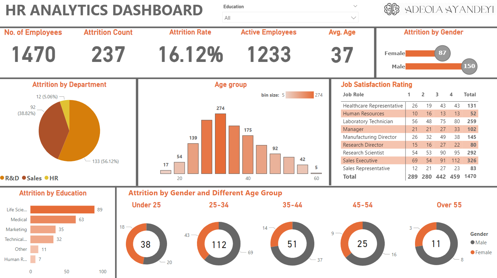

# HR Analytics with Tableau and Power BI

This project aims to analyze HR data using Tableau and Power BI to gain insights into various key performance indicators (KPIs) related to attrition, education, job satisfaction, and gender.

## KPIs: 
In this section, we counted the number of employees, the attrition count, attrition rate, active employees and average age of employees.

## Attrition by Department

In this section, we analyze the attrition rate by department. We visualize the attrition trends and identify departments with the highest attrition rates. This analysis helps in understanding the factors contributing to attrition and enables HR teams to take proactive measures.

## Attrition by Education

Here, we explore the relationship between attrition and education level. We create visualizations to compare attrition rates across different education categories. This analysis provides insights into the impact of education on attrition and helps in identifying areas for improvement.

## Job Satisfaction Rating

In this section, we focus on job satisfaction ratings. We analyze the distribution of job satisfaction scores and identify factors that influence employee satisfaction. By understanding the drivers of job satisfaction, organizations can take steps to improve employee engagement and reduce attrition.

## Attrition by Gender

Here, we examine the attrition rates based on gender. We visualize the attrition trends for male and female employees separately and compare the rates. This analysis helps in identifying any gender-related patterns in attrition and enables organizations to address any gender-specific challenges.

Here is a visuals of the analysis.
## With Tableau

## With PowerBI

## Conclusion

In conclusion, this project leverages Tableau and Power BI to analyze HR data and gain insights into key aspects of attrition, education, job satisfaction, and gender. By understanding these factors, organizations can make data-driven decisions to improve employee retention and satisfaction.
